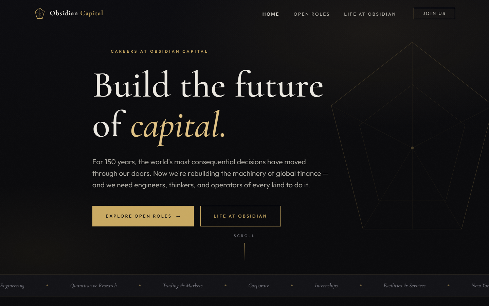
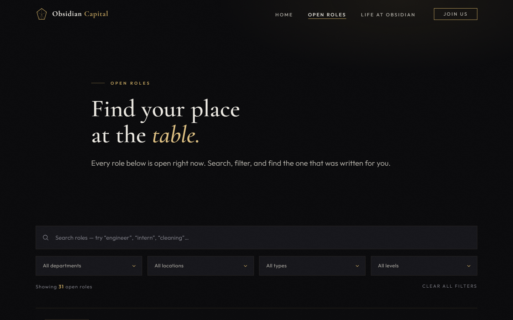
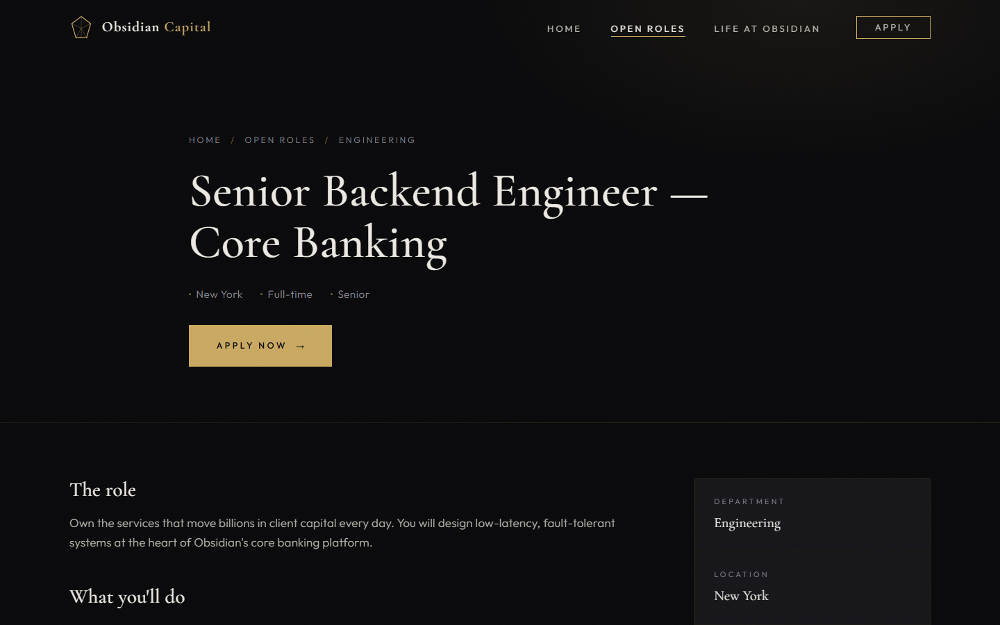
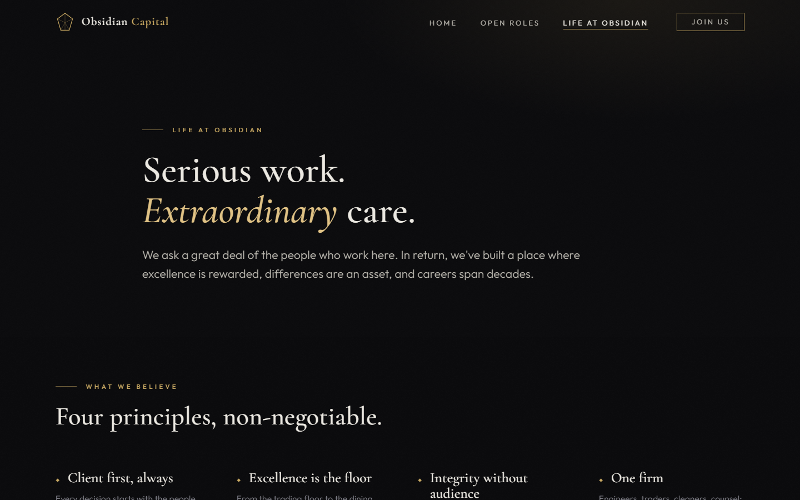

<div align="center">

# Obsidian Capital — Careers

**A high-end careers website for a fictional global investment bank, built from scratch with zero frameworks and zero dependencies.**

### [🌐 View the Live Site](https://xswarajx.github.io/obsidian-capital-careers/)




</div>

---

## The Project

Obsidian Capital is a fictional Goldman Sachs–tier investment bank. This is its careers site: a complete, four-page hiring experience covering **31 open roles across 6 departments** — from senior quant researchers and low-latency systems engineers to internships, catering, and cleaning staff — with live search, filtering, job detail pages, and a fully validated application flow.

Everything is hand-built: the design system, the animation engine, the job board logic, and the form validation. **No frameworks, no libraries, no build step.** The only external resource is Google Fonts.

## Features

- 🔍 **Live job board** — instant multi-term text search combined with department, location, type, and seniority filters over a structured 31-role dataset, with live result counts, staggered reveal animations, and an empty state
- 📄 **Dynamic job detail pages** — a single `job.html` renders any role from a `?id=` URL parameter: responsibilities, requirements, compensation band, sticky facts sidebar, "similar roles" recommendations, and a graceful fallback for invalid links
- ✍️ **Validated application form** — inline, per-field validation (name, email, phone, URL, file attachment, minimum-length cover letter) with accessible `aria-live` error messaging and an animated, personalized success state
- 🎬 **Custom motion engine** — IntersectionObserver scroll reveals with stagger, parallax hero layers, eased animated counters, a custom cursor that responds to interactive elements, and a marquee ticker — all written from scratch in ~150 lines
- ♿ **Accessibility built in** — full `prefers-reduced-motion` support (every animation disabled), semantic landmarks, `aria-current` navigation states, labeled form controls, keyboard-reachable interactions
- 📱 **Fully responsive** — fluid `clamp()` typography, adaptive grids, and a full-screen mobile menu with animated toggle
- 🔗 **Deep-linkable state** — department filters are URL-addressable (`careers.html?dept=Engineering`), so every footer and department card links straight into a pre-filtered board

## Screenshots

| Job Board | Job Detail |
|:---:|:---:|
|  |  |

| Life at Obsidian |
|:---:|
|  |

## Design System

The entire visual language lives in [`css/main.css`](css/main.css) as CSS custom properties:

| Token | Value | Role |
|---|---|---|
| Background | `#0a0a0c` | Near-black canvas with SVG grain overlay |
| Accent | `#c9a962` | Champagne gold — hairlines, CTAs, details |
| Display type | Cormorant Garamond | Editorial serif headlines |
| UI type | Outfit | Light grotesque body & labels |
| Easing | `cubic-bezier(0.22, 1, 0.36, 1)` | Signature "luxe" deceleration curve |

## Architecture

```
├── index.html          Home — hero, animated stats, departments, featured roles
├── careers.html        Job board — search + 4 filters over the dataset
├── job.html            Job detail + application form (renders from ?id=)
├── culture.html        Benefits, offices, employee stories, hiring timeline
├── css/
│   └── main.css        Complete design system (~1,100 lines, token-driven)
└── js/
    ├── jobs-data.js    31-role dataset — single source of truth
    ├── main.js         Shared motion engine: reveals, cursor, counters, parallax
    ├── careers.js      Board rendering, search, filter, deep-link logic
    └── job.js          Detail rendering + form validation state machine
```

The job dataset is the single source of truth: department cards compute their own role counts, the featured-roles strip sorts by posting date, filter dropdowns populate themselves, and the closing CTA counts roles live — add a job to the array and every page updates.

## Run Locally

No install, no build:

```bash
git clone https://github.com/xSwaraJx/obsidian-capital-careers.git
cd obsidian-capital-careers
python -m http.server 8000   # or: npx serve
```

Open `http://localhost:8000`.

## Author

**Swaraj Gamare**

- GitHub: [@xSwaraJx](https://github.com/xSwaraJx)
- Email: [swaraj.sugat.gamare@gmail.com](mailto:swaraj.sugat.gamare@gmail.com)

---

<div align="center">
<sub>Obsidian Capital is a fictional company created for this project. Any resemblance to real institutions is aspirational.</sub>
</div>
